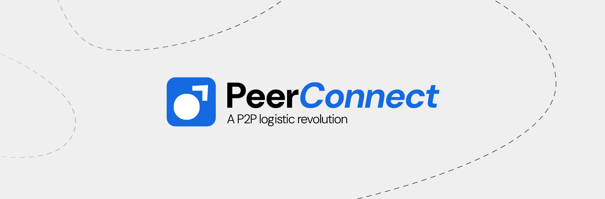

<div align="center">
<h1> Welcome to PeerConnect </h1>


<br>


</div>

## About Peer Connect

PeerConnect is a peer-to-peer (P2P) delivery system that enables users to send and receive packages efficiently. By leveraging travelers who are already moving between locations, PeerConnect aims to reduce delivery time and cost compared to traditional logistics services.

## Table of Contents

- [About PeerConnect](#-about-peerconnect)
- [How It Works](#-how-it-works)
  - [Sending Packages](#-sending-packages)
  - [Receiving & Delivering Packages](#-receiving--delivering-packages)
  - [Payment System](#-payment-system)
- [Tech Stack](#-tech-stack)
- [Contribution Guidelines](#-contribution-guidelines)
- [Repository Structure](#-repository-structure)
- [Security and Privacy](#-security-and-privacy)
- [Roadmap](#-roadmap)
- [Contact](#-contact)

## How It Works

### Sending Packages

1. Users can list a package for delivery by providing:
   - Pickup and delivery locations
   - Item description (weight, size, and contents)
   - Receiver's contact information
2. The package will be visible to travelers heading to the same destination.
3. Once a traveler picks up the package, the sender can track its progress in real time.
4. The receiver collects the package at the delivery location.

### Receiving & Delivering Packages

1. Travelers set their journey details (starting location and destination).
2. The app shows a list of available packages along the same route.
3. Travelers can pick up packages, deliver them, and receive payment after successful delivery.

### Payment System

- **Prepaid:** The sender pays in advance, and the payment is held until the package is delivered.
- **Pay on Delivery:** A QR code is generated, allowing the receiver or sender to pay at the time of delivery.

## Tech Stack

- **Frontend:** React Native (for cross-platform mobile app development)
- **Backend:** Node.js with Express (for APIs and data management)
- **Database:** Firebase / MongoDB (for real-time tracking and storage)
- **Maps & Location Services:** Google Maps API / OpenStreetMap
- **Authentication:** Clerk Auth / OAuth

## Repository Structure

```
PeerConnect/
│-- app/
│   │-- (auth)/       # App screens/pages
│   │-- (root)/       # Navigation setup
│-- assets/           # Static assets (images, icons, etc.)
│-- components/       # Reusable components
│-- constants/        # To store all contant values
│-- scripts/
│-- types/            # To define types
│-- .gitignore
│-- package.json
│-- README.md
```

## Security and Privacy

- Secure authentication with clerk Auth/OAuth.
- Encrypted data transmission.
- Privacy-focused tracking system.
